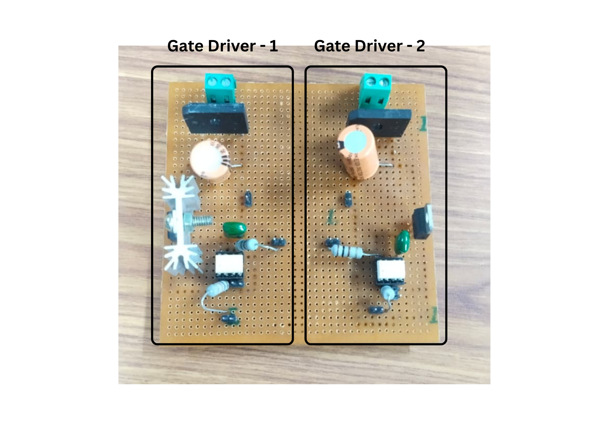
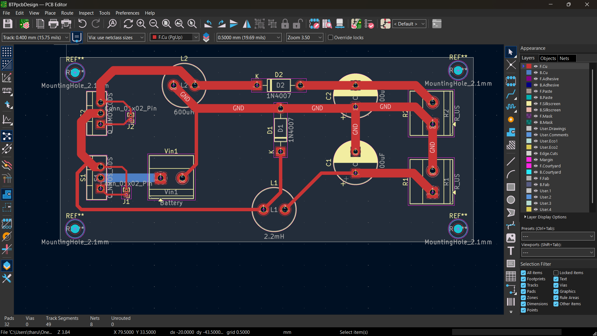
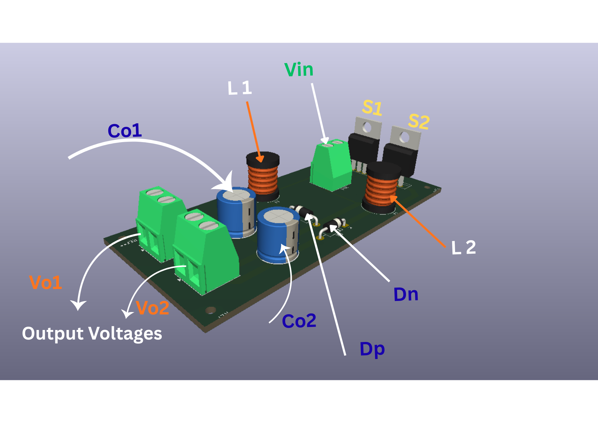

# Minimum-Phase Single-Input Dual-Output Buck and Buck–Boost DC–DC Converter for DC Microgrid Application

This repository contains the complete reproduction, analysis, simulation, controller improvement, and hardware validation of a **minimum-phase single-input dual-output (SIDO) DC–DC converter** based on the IEEE research paper:

**“Dual-Output Classic Buck and Buck–Boost Converter with Fast Dynamic Response”**

The converter generates two regulated DC outputs from a single DC source:

- Positive Buck Output
- Negative Buck–Boost Output

using two independent duty control parameters:

- Main duty cycle **D**
- Secondary duty cycle **d₁**

This work was completed as my **B.Tech Project (BTP)** at **Indian Institute of Technology Patna**, under the supervision of **Dr. Bussa Vinod Kumar**.

---

# Project Objective

The objective of this work is not only to reproduce the IEEE paper results but also to perform an extensive analysis and improve the converter performance.

The project includes:

- Understanding converter operation and switching states
- Mathematical modeling using state-space averaging
- Deriving small-signal transfer functions
- MATLAB/Simulink based open-loop verification
- Closed-loop controller design and comparison
- Improving dynamic response using advanced compensation techniques
- Hardware implementation and experimental verification

The proposed converter removes the traditional **Right-Half-Plane Zero (RHPZ)** problem present in conventional buck–boost converters, resulting in:

- Minimum-phase behavior
- Faster dynamic response
- Easier controller design
- Better transient performance

---

# Converter Specifications

## Open-Loop Experimental Parameters

The following parameters were used for simulation and hardware verification.

| Parameter | Value |
|---|---|
| Input Voltage (Vin) | 12 V / 24 V |
| Inductor L1 | 2 mH |
| Inductor L2 | 500 µH |
| Output Capacitors C01, C02 | 47 µF |
| Switching Frequency | 50 kHz |
| Output Resistance (Buck) | 100 Ω |
| Output Resistance (Buck–Boost) | 100 Ω |
| Main Duty Cycle D | 0.5 |
| Secondary Duty Cycle d₁ | 0.2 |

---

# Theoretical Voltage Gain Verification

## Buck Output

The buck output voltage gain:

```math
M_{o1}=D
```

For:

- Vin = 12 V

```math
V_{o1}=0.5 \times 12 = 6V
```

- Vin = 24 V

```math
V_{o1}=0.5 \times 24 = 12V
```

---

## Buck–Boost Output

Voltage conversion ratio:

```math
M_{o2}= \frac{D}{1-D-d_1}
```

For Vin = 12 V:

```math
V_{o2}=\frac{0.5 \times 12}{1-0.5-0.2}=20V
```

For Vin = 24 V:

```math
V_{o2}=\frac{0.5 \times 24}{1-0.5-0.2}=40V
```

The obtained experimental results closely matched the theoretical calculations.

---

# Simulation Based Verification

## 1. Open-Loop Converter Simulation

Implemented complete switching model in MATLAB/Simulink.

Verified:

- Three operating modes
- Inductor charging/discharging behavior
- MOSFET switching operation
- Diode current characteristics
- Capacitor voltage balancing
- Output voltage gain equations


Validated converter gains:

Buck:

```math
M_{o1}=D
```

Buck–Boost:

```math
M_{o2}=\frac{D}{1-D-d_1}
```

Simulation results successfully reproduced the IEEE paper.

---

# Hardware Implementation

A hardware prototype was developed to experimentally validate the converter operation.

Implementation includes:

- Power stage design
- MOSFET based switching circuit
- Dual inductor energy transfer system
- Gate driver implementation
- Output filtering stage
- Experimental waveform verification


## Hardware Prototype

Add prototype images:

### Prototype Board
```
images/prototype.png
```

```
images/gate_driver.png
```
### Gate Drivers



---

# PCB Design and 3D Modeling

The complete converter hardware was designed using **KiCad EDA**.

Implemented:

- Circuit schematic design
- PCB layout design
- Component footprint selection
- Power routing considerations
- 3D visualization


## KiCad Schematic

```
images/kicad_schematic.png
```




## KiCad 3D Model

```
images/kicad_3d_model.png
```



---

# Small Signal Modeling and Transfer Function Analysis

Using state-space averaging, the converter transfer functions were derived.

Analyzed:

## Input-to-output transfer function

```math
G_{vov}
```

## Duty-to-output transfer function

```math
G_{vod}
```

Verified:

- Buck output stability
- Buck–Boost minimum-phase behavior
- Absence of RHP zero
- Improved controllability compared with traditional converters

---

# Controller Design and Improvement

## IEEE Paper Implementation

The reference paper implemented a:

- PI Controller

The PI controller successfully regulates the output voltage but has limitations:

- Slower transient response
- Higher settling time
- Limited phase improvement


---

# Proposed Improvement: PI–Lead Controller

As an improvement over the IEEE paper, a **PI–Lead compensator** was designed.

Separate controllers were developed for both outputs.

## Buck Output Controller

Designed parameters:

- Crossover frequency ≈ 1.7 kHz
- Phase margin ≈ 30°

## Buck–Boost Output Controller

Designed parameters:

- Crossover frequency ≈ 500 Hz
- Phase margin ≈ 30°

Advantages compared with PI controller:

✔ Faster transient response  
✔ Improved stability margin  
✔ Reduced settling time  
✔ Better dynamic behavior  
✔ Zero steady-state error  

The designed PI–Lead controller achieved better performance compared with the controller reported in the reference paper.

---

# Closed-Loop Testing

The controller performance was verified under:

## Input Voltage Variation

Checked converter response for sudden source changes.

## Reference Voltage Tracking

Verified output voltage tracking capability.

## Load Disturbance Test

Validated robustness during load variations.


Results:

- Stable voltage regulation
- Improved transient response
- Fast recovery
- Minimum overshoot

---

# Software and Tools Used

## Simulation

- MATLAB R2021b+
- Simulink
- Control System Toolbox

## Hardware Design

- KiCad EDA
- PCB Design Tools
- Digital Oscilloscope
- Function Generator
- DC Power Supply


---

# Key Learning Outcomes

- DC–DC converter modeling
- State-space averaging technique
- Small-signal analysis
- Transfer function derivation
- Stability analysis using Bode plots
- Power electronics hardware design
- PCB schematic and layout development
- Controller design and optimization
- MATLAB to hardware workflow

---

# Future Scope

- Complete PCB fabrication
- High power testing
- Efficiency optimization
- Digital controller implementation using STM32/DSP
- MPPT integration for renewable applications
- DC microgrid integration

---

# Reference Paper

Hasanpour, S., Mostaan, A., & Haghighi, S. K. S. (2024).

**Dual-Output Classic Buck and Buck–Boost Converter with Fast Dynamic Response**

IEEE Journal of Emerging and Selected Topics in Industrial Electronics.

---

# Author

**Y. Tharun Teja**  
B.Tech Electrical Engineering  
Indian Institute of Technology Patna  

---

# License

Released under the MIT License.
